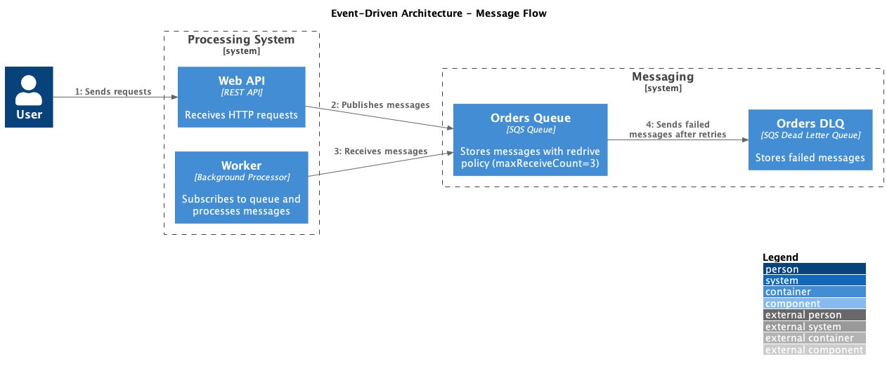

# aws-sqs-dotnet-demo

Demo application showcasing an asynchronous event-driven order processing using **Amazon SQS** and **.NET 10**.

## Table of Contents

- [Overview](#overview)
- [Project Structure](#project-structure)
- [Prerequisites](#prerequisites)
- [Getting Started](#getting-started)
- [API Reference](#api-reference)
- [Queue Configuration](#queue-configuration)
- [Observability](#observability)
- [Integration Testing](#integration-testing)
- [Load Testing](#load-testing)
- [Technology Stack](#technology-stack)

## Overview



When a client submits an order via the REST API, the request is validated, an `OrderCreatedEvent` domain event is serialised and published to an **SQS queue**. A separate **worker service** continuously polls the queue and processes each event asynchronously. Failed messages are automatically redirected to a **Dead Letter Queue (DLQ)** after three unsuccessful processing attempts.


LocalStack is used to emulate the AWS SQS service locally, eliminating the need for an active AWS account during development.

### Projects

| Project | Type | Responsibility |
|---|---|---|
| `Order.Core` | Class Library | Domain models, messaging contracts (`IProducer<T>`, `IEventHandler<T>`). No external dependencies. |
| `Order.Infrastructure` | Class Library | AWS SQS producer and consumer implementations. Encapsulates all AWS SDK interactions. |
| `Order.WebApi` | ASP.NET Core | REST API. Validates requests and publishes `OrderCreatedEvent` to SQS. |
| `Order.Worker` | Worker Service | Background service that consumes and processes events from the SQS queue. |

## Project Structure

```
aws-sqs-dotnet-demo/
├── src/
│   ├── Order.Core/                 # Domain models and contracts
│   │   ├── Events/
│   │   │   └── OrderCreatedEvent.cs
│   │   └── Messaging/
│   │       ├── IEventHandler.cs
│   │       └── IProducer.cs
│   ├── Order.Infrastructure/       # AWS SQS integration
│   │   └── Messaging/
│   │       ├── SQSProducer.cs
│   │       └── SQSConsumer.cs
│   ├── Order.WebApi/               # REST API
│   │   └── Endpoints/V1/Create/
│   │       ├── CreateOrderEndpoint.cs
│   │       ├── CreateOrderRequest.cs
│   │       └── CreateOrderRequestValidator.cs
│   └── Order.Worker/               # Background worker
│       └── Handlers/
│           └── OrderCreatedEventHandler.cs
├── tests/
│   ├── Order.WebApi.IntegrationTests/  # Integration tests with Testcontainers
│   └── Order.WebApi.LoadTests/         # k6 load tests
├── .localstack/init/
│   └── 01-create-queues.sh         # Queue provisioning script
├── .otel/                          # OpenTelemetry observability stack config
│   ├── otel-collector-config.yml
│   ├── loki.yml
│   ├── tempo.yml
│   ├── prometheus.yml
│   └── grafana/
│       └── provisioning/
│           └── datasources/
│               └── datasources.yml
├── compose.yml
├── Dockerfile
└── Makefile
```

## Prerequisites

| Tool | Minimum Version |
|---|---|
| [Docker](https://www.docker.com/) | 24+ |
| [Docker Compose](https://docs.docker.com/compose/) | 2.20+ |
| [.NET SDK](https://dotnet.microsoft.com/) *(optional, for local dev)* | 10.0 |
| [k6](https://k6.io/) *(optional, for load tests outside Docker)* | 0.50+ |

## Getting Started

### 1. Clone the repository

```bash
git clone https://github.com/joaopaulopmedeiros/aws-sqs-dotnet-demo.git
cd aws-sqs-dotnet-demo
```

### 2. Start all services

```bash
make up
```

This command starts the following containers via Docker Compose:

| Container | Description | Port |
|---|---|---|
| `localstack` | AWS SQS emulator | `4566` |
| `api` | Order REST API | `8080` |
| `worker` | SQS consumer worker | — |

LocalStack automatically provisions the `orders` and `orders-dlq` queues on startup via the initialisation script at `.localstack/init/01-create-queues.sh`.

### 3. Verify the services are running

```bash
docker compose ps
```

The API exposes a health check endpoint:

```bash
curl http://localhost:8080/health
```

### 4. Create an order

```bash
curl -X POST http://localhost:8080/v1/orders \
  -H "Content-Type: application/json" \
  -d '{
    "customerId": "CUST-001",
    "items": [
      { "productId": "PROD-001", "quantity": 2, "unitPrice": 49.99 }
    ]
  }'
```

A successful request returns **HTTP 202 Accepted**. The `Order.Worker` container will log the consumed event shortly after.

### 5. Stop all services

```bash
make down
```

## API Reference

### POST `/v1/orders`

Creates a new order and publishes an `OrderCreatedEvent` to the SQS queue.

**Request body**

```json
{
  "customerId": "string (required)",
  "items": [
    {
      "productId": "string (required)",
      "quantity": "integer (required, min: 1)",
      "unitPrice": "decimal (required, min: 0.01)"
    }
  ]
}
```

**Responses**

| Status | Description |
|---|---|
| `202 Accepted` | Event published successfully. |
| `400 Bad Request` | Validation failed. Response body contains detailed error messages. |

**Interactive documentation** (Development environment only):

- OpenAPI spec: `http://localhost:8080/openapi/v1.json`
- Scalar UI: `http://localhost:8080/scalar`

## Queue Configuration

Queues are provisioned by `.localstack/init/01-create-queues.sh` on LocalStack startup.

| Attribute | `orders` | `orders-dlq` |
|---|---|---|
| Type | Standard | Standard (DLQ) |
| Visibility Timeout | 30 s | 30 s |
| Message Retention | 1 day | 14 days |
| Max Receive Count | 3 | — |

Messages that fail processing after **3 attempts** are automatically moved to `orders-dlq` via the SQS Redrive Policy.

## Observability

The API and Worker are instrumented with **OpenTelemetry** (logs, traces, and metrics), exported via OTLP to a local collector that fans out to the Grafana stack.

### Containers

| Container | Description | Port |
|---|---|---|
| `otel-collector` | Receives OTLP and routes signals | `4317` (gRPC), `4318` (HTTP) |
| `loki` | Log storage | `3100` |
| `tempo` | Trace storage | `3200` |
| `prometheus` | Metrics storage | `9090` |
| `grafana` | Visualisation UI | `3000` |

### Accessing Grafana

Open `http://localhost:3000` — no login required (anonymous access enabled).

The following datasources are provisioned automatically:

| Datasource | URL |
|---|---|
| Prometheus | `http://localhost:9090` |
| Loki | `http://localhost:3100` |
| Tempo | `http://localhost:3200` |

Tempo is configured with correlations to Loki (trace → logs) and Prometheus (service map).

## Integration Testing

The `Order.WebApi.IntegrationTests` project contains integration tests that exercise the full HTTP stack against a real SQS-compatible dependency.

### How it works

[Testcontainers for .NET](https://dotnet.testcontainers.org/) is used to spin up an ephemeral LocalStack container (`localstack/localstack:4.13.1`) before the test suite runs. `WebApplicationFactory<Program>` boots the actual ASP.NET Core app in-process and is reconfigured at runtime to point at the container's SQS endpoint.

```
Test run
 └── OrderWebApiFactory (IAsyncLifetime)
      ├── Starts LocalStack container via Testcontainers
      ├── Creates the "orders" SQS queue
      ├── Overrides AWS:ServiceURL and Messaging:QueueUrl in-process
      └── Disposes the container when the suite finishes
```

### Test cases

| Test | Expected |
|---|---|
| Valid request | `202 Accepted` |
| Missing `customerId` | `400 Bad Request` |
| Empty `items` list | `400 Bad Request` |
| Item with empty `productId` | `400 Bad Request` |
| Item with `quantity` = 0 | `400 Bad Request` |
| Item with `unitPrice` = 0 | `400 Bad Request` |

### Running the tests

```bash
dotnet test tests/Order.WebApi.IntegrationTests
```
Docker must be running: Testcontainers pulls and starts the LocalStack image automatically.

## Load Testing

A [k6](https://k6.io/) load test script is included to simulate concurrent order creation.

```bash
make load
```

This command starts a `k6` container (Docker Compose `load` profile) that targets the API and reports throughput, latency, and error rate metrics.

## Technology Stack

| Layer | Technology |
|---|---|
| Runtime | .NET 10 |
| Web Framework | ASP.NET Core Minimal APIs |
| Messaging | Amazon SQS (AWS SDK for .NET v3) |
| Validation | FluentValidation |
| API Documentation | Scalar, OpenAPI |
| Local AWS Emulation | LocalStack |
| Containerisation | Docker, Docker Compose |
| Integration Testing | xUnit, Testcontainers for .NET, WebApplicationFactory |
| Load Testing | k6 |
| Observability | OpenTelemetry, Loki, Tempo, Prometheus, Grafana |
